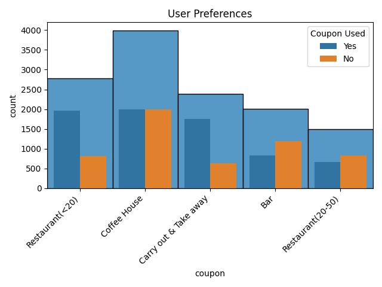
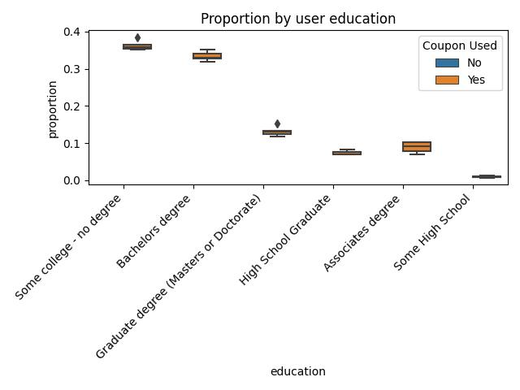
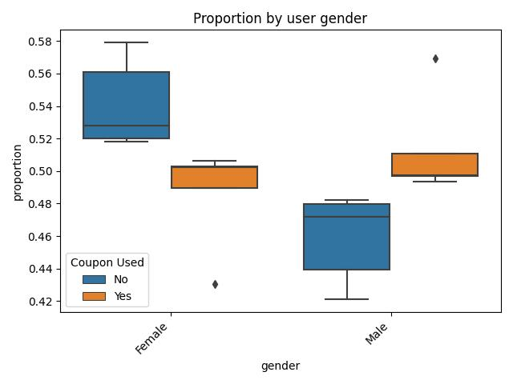
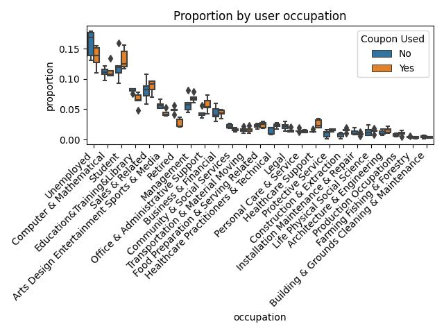
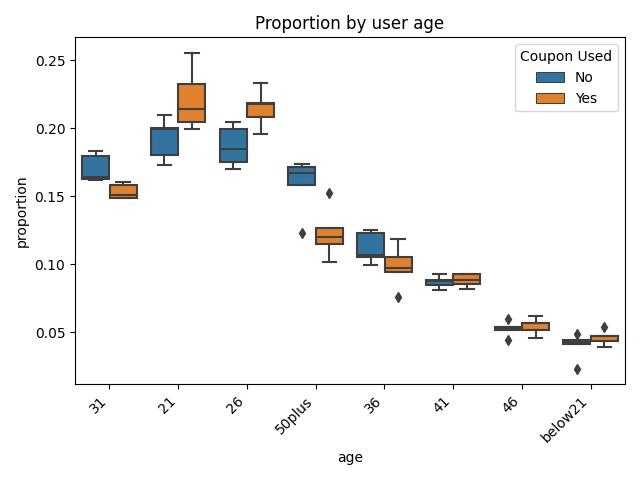
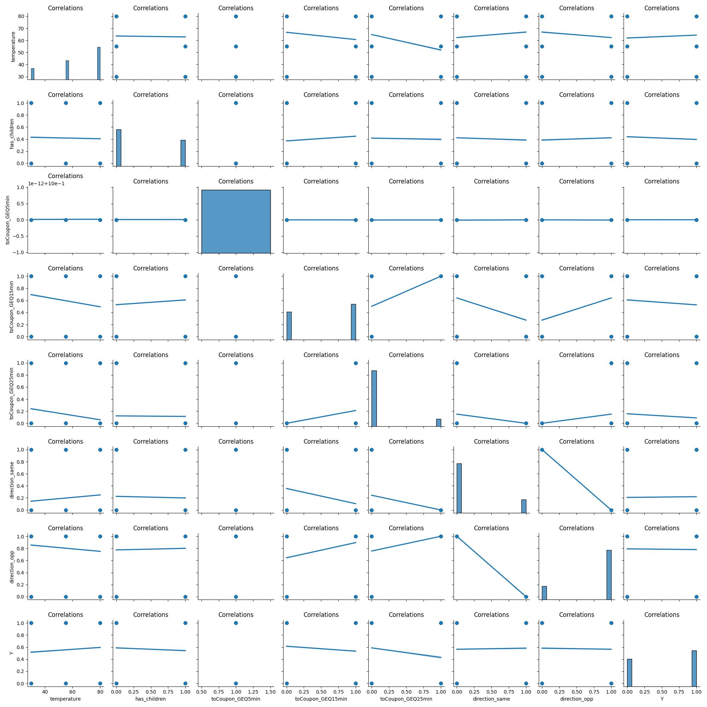

# Will the customer accept the coupon?

## Overview

In this first practical application assignment of the program, you will seek to answer the question, “Will a customer accept the coupon?” The goal of this project is to use what you know about visualizations and probability distributions to distinguish between customers who accepted a driving coupon versus those that did not.
<br></br>

## Methodology

Analysis based on Data set: in-vehicle coupon recommendation

+ [Data folder](https://archive.ics.uci.edu/ml/machine-learning-databases/00603/)
+ [Attribute information](https://archive.ics.uci.edu/ml/datasets/in-vehicle%20coupon%20recommendation#)
+ [Coupon Jupyter Notebook](./Coupon.ipynb)
  (prerequisites: ```pip install -r [requirements.txt](requirements.txt)```

## Findings

1. Preferred coupon categories: **"Carry out & Takeaway"** and **"Restaurants (<20)"**

    

2. **Differences between customers who did and did not accept the coupons.**

+ Overall not a huge difference based on education, except for
  + used more - college - no degree
  + used less - masters or doctorate

    

+ Gender
  + male tend to use coupons more than female

    

+ Occupation
  + larger populations from unemployed, Computer math student
  + Student without specialization tend to use the coupons more
    

+ Age
    

3. Correlation plots

+ work in progress
  

## Next Steps

+ Additional care should be taken to see if conditions were the same for the different education groups. In other words, need to see if something skews the data.
+ Update Correlation plot so it is based on density / normalized population instead of discrete values

<!---
## Grading Criteria

### Criteria 1 - Project Organization (20 pts)

+ [x] A README file with summary of findings and link to notebook
+ [x] Jupyter notebook with headings and text appropriately formatted
+ [x] No unnecessary files (used .gitignore)
  + included [requirements.txt](requirements.txt) file for easier setup
  + may include downloaded copy of .csv
+ [x] Directories and files have appropriate names and location

### Criteria 2 - Syntax and Code quality (20 pts)

+ [X] Libraries are imported and aliased correctly
+ [X] Code does not contain errors
+ [X] No long strings of code output
+ [ ] Demonstrates competency with pandas
+ [ ] Demonstrates competency with seaborn
+ [X] Comments are used appropriately to explain code
+ [X] Variables are sensible

### Criteria 3 - Visualizations (30 pts)

+ [ ] Appropriate plots for categorical and continuous variables are utilized
+ [X] Plots contain human readable labels
+ [X] Plots contain descriptive titles
+ [X] Axes are legible
+ [X] Subplots are used when appropriate
+ [X] Plots are scaled appropriately for readability

### Criteria 4 - Findings (30 pts)

+ [ ] Clearly stated problem for specific coupon group
+ [X] Visualizations that demonstrate exploring differences in those who accepted and rejected the coupon
+ [ ] Interpretation of descriptive and inferential statistics is correct and concise
+ [ ] The findings are clearly stated in their own section with actionable items highlighted
+ [ ] Next steps and recommendations
-->